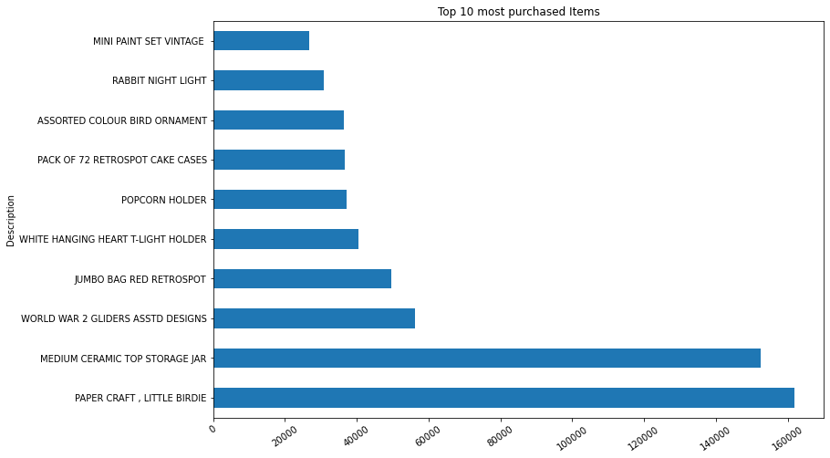

# **Laporan Proyek Machine Learning - Tony Wijaya**
## Domain Proyek
### Latar Belakang

Saat ini, setiap orang perlu bersiap menghadapi pergeseran budaya di mana kemajuan teknologi dituntut untuk memenuhi semua kebutuhan. Dalam hal kebutuhan, manusia saat ini tidak hanya memenuhi kebutuhannya akan pangan, sandang dan papan, tetapi juga kebutuhannya sendiri. Namun, fokusnya juga pada layanan, kualitas dan harga produk dan layanan penjualan. Hal ini memberikan peluang bagi sebagian besar perusahaan _e-commerce_ untuk mempresentasikan marketplace mereka dalam bentuk jual beli barang secara online. *E-commerce* mencakup semua proses pengembangan, pemasaran, penjualan, pengiriman, pelayanan dan pembayaran pelanggan, didukung oleh jaringan bisnis mitranya yang lebih luas. Sistem yang digunakan untuk memanfaatkan _e-commerce_ sangat bergantung pada Internet, dan jumlah pengguna potensial meningkat dari tahun ke tahun [1]. 
Salah satu contoh industri yang menggunakan _e-commerce_ adalah industri ritel. Dalam industri ritel, _e-commerce_ telah menjadi saluran penting bagi perusahaan-perusahaan untuk menjual produk mereka kepada konsumen. Melalui platform _e-commerce_ seperti Tokopedia, Shopee, Blibli, Amazon dan banyak lagi. konsumen dapat dengan mudah membeli berbagai jenis produk seperti pakaian, sepatu, peralatan elektronik, dan masih banyak lagi.
*Dataset* transaksi ritel online berisi informasi tentang transaksi yang dilakukan oleh pelanggan melalui platform _e-commerce_. *Dataset* ini berisi data tentang produk yang dibeli, jumlah setiap produk, tanggal dan waktu setiap transaksi, harga setiap produk, pengidentifikasi unik untuk setiap pelanggan yang melakukan pembelian, dan negara tempat setiap pelanggan berada. Kumpulan data ini dapat digunakan untuk menganalisis perilaku dan preferensi pelanggan, mengidentifikasi produk populer, dan mengoptimalkan harga dan strategi pemasaran. Kumpulan data ini berisi sejumlah besar data transaksional yang dapat digunakan untuk melatih model prediktif dan membuat keputusan berdasarkan data, menjadikannya ideal untuk analitik data dan aplikasi pembelajaran mesin.
Secara keseluruhan, analisis perilaku pelanggan menjadi penting dalam konteks _e-commerce_ karena membantu memahami dan memenuhi kebutuhan pelanggan, mengoptimalkan strategi bisnis, dan meningkatkan pengalaman pelanggan. Dengan memanfaatkan data dan informasi yang diperoleh dari analisis perilaku pelanggan, perusahaan dapat meningkatkan daya saing mereka dalam pasar _e-commerce_ yang kompetitif.

---
## Business Understanding

### Problem Statements
Menjelaskan pernyataan masalah latar belakang:

* Bagaimana menganalisis perilaku dan preferensi pelanggan untuk meningkatkan penjualan?
* Bagaimana mengindentifikasi produk populer untuk mengetahui target pasar?
* Bagaimana mengoptimalkan harga dan strategi untuk disesuaikan dipasar? 
---
### Goals
Menjelaskan tujuan dari pernyataan masalah:

* Melakukan analisa untuk menentukan perilaku dan preferensi pelanggan dengan menggunakan _cluster_ pelanggan untuk mengetahui target-target yang dibutuhkan.
* Melakukan identifikasi dan analisa produk populer untuk diberikan respon lebih agar pelanggan lebih tertarik untuk membelinya.
* Memberikan saran dan masukan untuk mengoptimalkan harga dan strategi pemasaran
---

### Tujuan

1. Menganalisis perilaku dan preferensi pelanggan
2. Mengindentifikasi produk populer
3. Mengoptimalkan harga dan strategi pemasaran
---
### Manfaat

1. Menambah pengalaman penulis dalam menganalisis _dataset_ transaksional yang kedepannya dapat membantu menganalisis data transaksi di toko sendiri yang masih menggunakan data tradisional yaitu pencatatan manual
## Data Understanding
### Dataset description

_Dataset_ yang digunakan berasal dari kaggle. _Dataset_ hanya berisi 1 data yaitu Online Retail.csv yang berisi data transaksional dari berbagai negara dan berisi sebanyak 541909 baris data.

Berikut adalah variabel yang digunakan pada _dataset_ tersebut
- _StockCode_: Kode yang digunakan untuk mengidentifikasi produk yang dibeli
- _Description_ : Keterangan singkat tentang produk yang dibeli
- _Quantity_: Jumlah produk yang dibeli
- _InvoiceDate_: Tanggal dan waktu pembelian dilakukan
- _UnitPrice_ : Harga satu unit produk yang dibeli
- _CustomerID_: Pengidentifikasi unik untuk pelanggan yang melakukan pembelian
- _Country_: Negara tempat pelanggan yang melakukan pembelian berada
---

Setelah dilakukan pembersihan dapat dilihat rincian dari masing-masing variabel

### Describe Variable

1. Berikut adalah deskripsi value dari variabel yang bersifat angka yang terdiri dari jumlah, rata-rata, standar deviasi, minimum, maksimum dan persentil.

Tabel 1. Deskripsi Variabel Angka

|           |   count |       mean |       std |      min |     25% |     50% |     75% |      max |
|:----------|--------:|-----------:|----------:|---------:|--------:|--------:|--------:|---------:|
| Quantity  |  533429 |   10.9399  | 216.507   |    1     |    1    |    3    |   11    |  80995   |
| UnitPrice |  533429 |    4.26289 |  72.8431  |    0.001 |    1.25 |    2.1  |    4.13 |  17836.5 |
| year      |  533429 | 2010.92    |   0.26833 | 2010     | 2011    | 2011    | 2011    |   2011   |
| month     |  533429 |    7.54822 |   3.50859 |    1     |    5    |    8    |   11    |     12   |
| day       |  533429 |   15.0197  |   8.66034 |    1     |    7    |   15    |   22    |     31   |
| weekday   |  533429 |    2.42596 |   1.84171 |    0     |    1    |    2    |    4    |      6   |
| Time      |  533429 |   13.0752  |   2.4481  |    6     |   11    |   13    |   15    |     20   |
| Sales     |  533429 |   21.168   | 375.958   |    0.001 |    3.9  |    9.92 |   17.7  | 168470   |

2. Berikut adalah deskripsi value dari variabel yang bersifat kategorikal objek yang mana terdiri dari jumlah data, jumlah data yang unik,data paling top dan berapa frekuensi data top itu muncul.

Tabel 2. Deskripsi Variabel Kategorikal

|        |   InvoiceNo | StockCode   | Description                        |   CustomerID | Country        | dayofweek   | Time of Day   | Month         |
|:-------|------------:|:------------|:-----------------------------------|-------------:|:---------------|:------------|:--------------|:--------------|
| count  |      533429 | 533429      | 533429                             |       533429 | 533429         | 533429      | 533429        | 533429        |
| unique |       23453 | 3934        | 4039                               |         4362 | 38             | 6           | 4             | 13            |
| top    |      573585 | 85123A      | WHITE HANGING HEART T-LIGHT HOLDER |        15287 | United Kingdom | Thursday    | Afternoon     | November 2011 |
| freq   |        1114 | 2295        | 2353                               |       132417 | 487199         | 102428      | 224359        | 83006         |

## Data Preparation

Langkah-langkah yang digunakan penulis adalah sebagai berikut
1. _Data_ _Preparation_
2. _Check_ _Data_ _Duplication_
3. _Check_ _Missing_ _Value_
4. _Data_ _Preprocessing_
5. _EDA_
6. Tentukan _features_ _cluster_ yang akan digunakan
7. Melakukan _standarscaler_ 

---
### Data Preparation
Langkah-langkah pada tahap _data_ _preparation_
1. Mulai dari mengimport _library_ yang akan dibutuhkan, 
2. Melakukan read data csv menggunakan _library_ pandas
3. Melakukan inspeksi sederhana 
    * Melihat 5 data pertama
    * Melihat berapa jumlah data
    * Melihat variabel dan tipe data untuk dianalisa
---
### Check Data Duplication

Terdapat 5268 data yang duplikat sehingga lebih baik di drop data yang akan digunakan untuk analisa.

---
### Check Missing Value

Tabel 3 . _Missing_ _Value_ 
| variable      | dtype      | count    | unique   |  missing |
| ------------- |------------| ---------| ---------|----------|
| InvoiceNo     | object     | 536641   | 25900    |    0     |
| StockCode     | object     | 536641   | 4070     |    0     |
| Description   | object     | 536641   | 4224     |    1454  |
| Quantity      | int64      | 536641   | 722      |    0     |
| InvoiceDate   | object     | 536641   | 23260    |    0     |
| UnitPrice     | float64    | 536641   | 1630     |    0     |
| CustomerID    | int64      | 536641   | 4372     |    0     |
| Country       | object     | 536641   | 38       |    0     |

Ada _missing_ _Value_ sebanyak 1454 pada bagian _Description_

---
### Data Preprocessing

1. _Fill_ _Missing_ _Value_ _Description_ dengan referensi _StockCode_ yang ada
    * Mengisi deskripsi yang kosong menggunakan referensi stock code yang sudah ada. Dengan memanfaatkan stock code yang ada dan memiliki deskripsi maka dapat diasumsikan bahwa adanya kode barang yang dijual dibanyak transaksi namun dikarenakan adanya salah input maka deksripsi yang ada hilang sehingga lebih baik diisi dengan referensi yang sudah ada.
2. Adanya Stock Code dengan huruf dan referensi tertentu
    Tabel 4. Stok dengan huruf referensi tertentu
    |InvoiceNo| StockCode|	Description   | Quantity| InvoiceDate        |	UnitPrice |	CustomerID |	Country    |
    |----------|----------|---------------|---------|--------------------|------------|------------|---------------|
    | C536379  |  D	      |Discount	      | -1	    |2010-12-01  09:41:00|	27.50	  |14527	   |United Kingdom |
    | 536569   |  M	      |Manual	      |  1	    |2010-12-01  15:35:00|	1.25	  |16274	   |United Kingdom |
    | C537581  |  S	      |SAMPLES	      | -1	    |2010-12-07  12:03:00|	12.95	  |15287	   |United Kingdom |
    | A563185  |  B	      |Adjust bad debt|	1	    |2011-08-12  14:50:00|	11062.06  |15287	   |United Kingdom |

    * Dengan asumsi bahwa ini merupakan sebuah kode dari invoice namun tidak merupakan bagian dari penjualan jadi lebih baik dibuang untuk meningkatkan kualitas analisis penjualan.
3. Inspeksi _Quantity_ dan _UnitPrice_ < 0
    * Tedapat data kuantitas dan unitprice yang kurang dari 0 dimana bernilai negatif. Dengan asumsi bahwa data yang ditulis terdapat kesalahan saat menginput maka diubah menjadi positif dengan funsgi abs.
4. Inspeksi _Quantity_ dan _UnitPrice_ = 0
    * Berbeda dengan data yang negatif ada kuantitas dan unit price yang berangka 0. Dengan asumsi bahwa ada kesalahan tulis dan akan menyebabkan perhitungan sales salah kedepannya maka sebaiknya data berikut dihapus.
5. _Invoicedate_ _to_ _datetime_
    * Sebelumnya data _Invoice_ _Date_ bertipe data object agar mempermudah analisis maka akan diubah kedalam bentuk datetime. Serta untuk memperkaya analisa maka dibuat kolom year(tahun), month(bulan), day(tanggal), weekday(hari), time(waktu), time of day(latar waktu) dari invoice date. 
6. _Sales_ = _Quantity_ * _UnitPrice_
    * Untuk mempermudah perhitungan transaksi maka dibuat sebuah kolom sales yaitu perkalian antara kuantitas dan unit price atau harga unit barang.

---
### EDA (Exploratory Data Anlaysis)
---

#### Distribusi transaksi di tiap negara

Tabel 6. Tabel Distribusi transaksi di tiap negara

| Country              |         Quantity |       UnitPrice |             year |           month |              day |       weekday |             Time |            Sales |
|:---------------------|-----------------:|----------------:|-----------------:|----------------:|-----------------:|--------------:|-----------------:|-----------------:|
| Australia            |  84447           |  4048           |      2.52377e+06 |  7662           |  18328           |  2862         |  14337           | 139898           |
| Austria              |   4935           |  1701.52        | 806402           |  3058           |   6641           |   712         |   4881           |  10243           |
| Bahrain              |    368           |    86.57        |  38208           |    98           |    218           |    14         |    259           |    959.88        |
| Belgium              |  23322           |  7540.13        |      4.16066e+06 | 15284           |  31795           |  5519         |  25327           |  41481.7         |
| Brazil               |    356           |   142.6         |  64352           |   128           |    480           |   128         |    320           |   1143.6         |
| Canada               |   2763           |   910.58        | 303661           |   963           |   2271           |    21         |   1490           |   3666.38        |
| Channel Islands      |   9495           |  3150.9         |      1.51829e+06 |  5130           |  10405           |  1837         |   8315           |  20218.7         |
| Cyprus               |   6382           |  3238.66        |      1.22462e+06 |  4434           |   7515           |  1403         |   7320           |  13505.6         |
| Czech Republic       |    750           |    88.15        |  60330           |   171           |    546           |    60         |    283           |    945.76        |
| Denmark              |   8282           |  1266.95        | 782259           |  3088           |   6661           |   816         |   4899           |  19142.5         |
| EIRE                 | 151780           | 32739.4         |      1.64234e+07 | 62775           | 124333           | 18442         |  98380           | 287627           |
| European Community   |    501           |   294.05        | 122671           |   373           |   1006           |   216         |    653           |   1308.75        |
| Finland              |  10740           |  3511.25        |      1.39562e+06 |  4662           |   8393           |  1476         |   7634           |  22214.2         |
| France               | 113654           | 28201           |      1.71554e+07 | 64102           | 125157           | 20832         | 103130           | 202938           |
| Germany              | 120954           | 33109.8         |      1.90295e+07 | 68937           | 144344           | 23531         | 114600           | 231324           |
| Greece               |   1558           |   713.29        | 293606           |   829           |   1595           |   248         |   1512           |   4810.52        |
| Hong Kong            |   4711           |  1096.78        | 559058           |  1484           |   5030           |   541         |   3326           |   9930.14        |
| Iceland              |   2458           |   481.21        | 365971           |  1383           |   2879           |   259         |   2219           |   4310           |
| Israel               |   4462           |  1073.19        | 591232           |  2204           |   4255           |   793         |   2770           |   8356.85        |
| Italy                |   8223           |  3848.56        |      1.61077e+06 |  6040           |  14063           |  1715         |  10229           |  18045.1         |
| Japan                |  26811           |   735.69        | 713840           |  2314           |   4596           |  1003         |   3890           |  39412.9         |
| Lebanon              |    386           |   242.44        |  90495           |    45           |   1215           |   135         |    450           |   1693.88        |
| Lithuania            |    652           |    99.44        |  70350           |   420           |    178           |   206         |    422           |   1661.06        |
| Malta                |    996           |   666.01        | 255397           |   996           |   1702           |   162         |   1343           |   2945.71        |
| Netherlands          | 200689           |  6285.93        |      4.75594e+06 | 15933           |  40504           |  4969         |  27725           | 285919           |
| Norway               |  19421           |  4848.46        |      2.16972e+06 |  9792           |  17338           |  2696         |  13764           |  35486.8         |
| Poland               |   3715           |  1422.27        | 685743           |  2229           |   3690           |   663         |   3806           |   7456.16        |
| Portugal             |  16294           |  4551.8         |      3.00834e+06 | 11732           |  19675           |  3462         |  18624           |  29602.8         |
| RSA                  |    351           |   248.1         | 114627           |   570           |    741           |   171         |    684           |   1002.31        |
| Saudi Arabia         |     85           |    24.11        |  20110           |    21           |    219           |    30         |    101           |    160.67        |
| Singapore            |   5234           |   791.09        | 432365           |  1109           |   3458           |   236         |   2521           |   9120.39        |
| Spain                |  29057           |  9778.88        |      5.07569e+06 | 17062           |  41661           |  6482         |  32446           |  65518.5         |
| Sweden               |  36523           |  1774.73        | 925033           |  3349           |   7306           |  1333         |   5663           |  40120.2         |
| Switzerland          |  30922           |  6795.59        |      4.00787e+06 | 14527           |  31966           |  5384         |  24068           |  57772.2         |
| USA                  |   3882           |   644.98        | 585201           |  2864           |   3359           |   397         |   4302           |   5429.86        |
| United Arab Emirates |    982           |   229.89        | 136748           |   402           |    479           |   114         |   1002           |   1902.28        |
| United Kingdom       |      4.89624e+06 |     2.10637e+06 |      9.79718e+08 |     3.68698e+06 |      7.31068e+06 |     1.184e+06 |      6.41569e+06 |      9.65962e+06 |
| Unspecified          |   3295           |  1196.41        | 888862           |  3286           |   7245           |  1206         |   6298           |   4740.94        |

Distribution transaksi tiap negara (Treemap)

Gambar 1. Distribusi tiap transaksi di tiap negara dalam bentuk treemap

Dapat dilihat ada tabel 1 yang sudah di grouping dake dalam penjumlahan berdasarkan negara. Dan pada gambar 1 data transaksi didominasi oleh United Kingdom atau lebih tepatnya data yang tercatat oleh pelanggan yang berasal dari united kingdom lebih banyak yang mana data kurang valid atau kurang cocok untuk membandingkannya dengan negara-negara lainnya.

---
#### Sales, Quantity, dan UnitPrice untuk setiap transaksi berdasarkan invoice

Tabel 5. _Sales_, _Quantity_, dan _Unitprice_ untuk setiap transaksi berdasarkan _invoice_

|           |   count |     mean |      std |   min |   25% |    50% |    75% |      max |
|:----------|--------:|---------:|---------:|------:|------:|-------:|-------:|---------:|
| Sales     |   23453 | 481.458  | 2072.68  |  0.38 | 97.73 | 249.64 | 443    | 168470   |
| Quantity  |   23453 | 248.824  | 1142.42  |  1    | 35    | 121    | 261    |  80995   |
| UnitPrice |   23453 |  96.9576 |  415.509 |  0.03 | 11.4  |  36.24 |  79.13 |  17836.5 |

Gambar 2. _Sales_, _Quantity_, dan _Unitprice_ untuk setiap transaksi berdasarkan _invoice_ dalam bentuk box plot

Untuk tiap transaksi dapat dilihat deskripsinya mulai dari jumlah data, rata-rata, standar deviasi, minimum, kuartil 1 hingga 3 dan maksimum. Dapat dilihat bahwa dengan sebuah dominasi quantitiy walaupun harga sebuah barang tidak sampai dengan 20k namun bisa membentuk sales yang tinggi juga.

---
#### Sales dalam waktu

Gambar 3. Total _Sales_ dalam 2 tahun

Gambar 4. Total _Sales_ per product dalam 2 tahun

Gambar 5. Total _Sales_ perbulan dalam 2 tahun

Gambar 6. Total _Sales_ perhari dalam 2 tahun

Gambar 7. Total _Sales_ perwaktu  dalam 2 tahun

> Dari analisa diatas dapat dilihat bahwa sales terbanyak terjadi ditahun 2011 namun saat dilakukan pengecekan terhadap datanya ditemukan bahwa tahun 2010 mempunyai data sebesar 41661 sedangkan tahun 2011 mempunyai data sebanyak 491768 yang mana berdasarkan proporsi dengan 92% didominasi tahun 2011 agak sulit untuk melihat perbandingan antar sales. Namun dapat dianalisa bahwa terjadi ledakan penjualan di akhir tahun,  titik penjualan tertinggi berada di hari selasa, serta proporsi transaksi terjadi di siang hari. Walaupun transaksi terbanyak terjadi di siang  hari namun sales terbanyak adalah orang-orang yang melakukan transaksi pada pagi hari. Dimana penulis menginisialisasikan pagi disini merupakan jam 6 - 12.
---

#### _Product_ _Analysis_

Gambar 8. _Top_ barang yang terjual selama 2 tahun

Gambar 9. _Wordcloud_ nama-nama barang yang terjadi transaksi

> Dapat dilihat dari 2 visualisasi berikut yaitu produk dengan penjualan terbanyak dan jenis produk yang paling jenisnya dijual tidak mencerminkan penjualan terbanyak. Jadi banyak produk dengan jenis yang sama sehingga penjualan sebuah produk tidak dapat dilihat penjualannya, ada baiknya mengkategorikan ke dalam jenis produk yang sama agar dapat mengetahui penjualan produk apa yang lebih baik ketimbang melakukan analisa seperti diatas.
---

### Tentukan Features Cluster yang akan digunakan

> Untuk mengetahui perilaku transaksi pelanggan maka algoritma yang cocok untuk menyelesaikan kasus diatas adalah kluster.
dimana menurut KBBI kluster adalah "beberapa benda atau hal yang berkelompok menjadi satu" atau lebih tepatnya mengelompokkan perilaku customer ke dalam kelompok-kelompok tertentu. 

> Features atau variabel yang akan mendukung  untuk menentukan perilaku pelanggan yaitu tentu _CustomerID_, _Quantity_, _UnitPrice_. Kenapa sales tidak termasuk karena sales merupakan perkalian dari kuantitas barang dan harga unit barang. Dengan 3 variabel itu maka  dapat melihat perilaku pelanggan saat menentukan harga dan berapa banyak jumlah barang yang akan dibeli.
---
### Melakukan StandarScaler
> _Standard Scaler_ merupakan metode preprocessing di mana metode tersebut akan melakukan standarisasi fitur dengan menghapus rata-rata dan menskalakan unit varian yang tentunya berguna membuat numerical data pada _dataset_ memiliki rentang nilai (scale) yang sama. Tidak ada lagi satu variabel data yang mendominasi variabel data lainnya. 
---

## Modeling

Untuk Menyelesaikan kasus segmentasi pelanggan maka menggunakan kasus _cluster_ yaitu _clustering_.
Clustering adalah teknik Pembelajaran Mesin yang melibatkan pengelompokan titik data. Mengingat sekumpulan titik data, kita dapat menggunakan algoritma pengelompokan untuk mengklasifikasikan setiap titik data ke dalam grup tertentu. Secara teori, titik data yang berada dalam grup yang sama harus memiliki sifat dan/atau fitur yang mirip, sedangkan titik data dalam grup yang berbeda harus memiliki sifat dan/atau fitur yang sangat berbeda. Kmeans adalah salah satu metode clustering yang bertujuan untuk mengelompokan suatu kumpulan data menjadi beberapa kelompok. Idenya adalah dengan mengelompokkan data yang memiliki kemiripan berada dalam 1 kelompok dan memisahkan data yang berbeda kedalam kelompok yang berbeda.

Berikut adalah langkah-langkah untuk melakukan _clustering_.

1. Evaluasi _cluster_ dengan metode _Elbow_ _Methods_ dan SSE(_Sum_ _of_ _Squares_ _Errors_)
2. Melakukan _cluster_ dengan algoritma kmeans sesuai dengan angka optimal k dari _Elbow_ _Methods_

---

## Evaluation

### Evaluasi cluster dengan metode Elbow Methods dan SSE(Sum of Squares Errors)

> Untuk menggunakan kmeans _cluster_ing  membutuhkan yang namanya jumlah kluster. Dengan metode elbow method  berupaya untuk menentukan jumlah kluster yang terbaik dengan melihat persentasenya. Namun dalam kasus ini  menggunakan kombinasi antara elbow method dan juga _sum_ _of_ _squares_ _errors_. Dengan teknik evaluasi dari elbow method dan sse maka  dapat menentukan jumlah kluster jatuh pada angka berapa. 

Gambar 10. _Elbow_ _Method_ dan SSE untuk menentukan nilai k

> Dapat dilihat melalui grafik bahwa angka optimal yang bagus untuk menentukan nilai kluster adalah saat kurva sudah menunjukkan angka yang konstan yaitu berada di angka 6
---
### Melakukan cluster dengan algoritma kmeans sesuai dengan angka optimal k dari _Elbow_ _Methods_

Berikut adalah hasil dari kluster yang dihasilkan

Tabel 8. Hasil ___Cluster___ dengan menggunakan optimal nilai k=6

|   Cluster |   ('Quantity', 'mean') |   ('Quantity', 'median') |   ('UnitPrice', 'mean') |   ('UnitPrice', 'median') |   ('CustomerID', 'count') |
|----------:|-----------------------:|-------------------------:|------------------------:|--------------------------:|--------------------------:|
|         0 |               12.0948  |                        4 |                 2.85305 |                      1.93 |                    132007 |
|         1 |               14.0531  |                        6 |                 3.18682 |                      1.95 |                    128078 |
|         2 |            77605       |                    77605 |                 1.56    |                      1.56 |                         4 |
|         3 |                1       |                        1 |              6013.77    |                   5876.4  |                        25 |
|         4 |                7.78879 |                        2 |                 4.47098 |                      2.46 |                    273307 |
|         5 |                1       |                        1 |             14607.9     |                  13541.3  |                         8 |

Dapat dilihat juga dalam bentuk _cluster_ distribusi persentase negara yang masuk dalam _cluster_ tersebut
---

Tabel 7. Distribusi _cluster_ digrup beradasarkan negara

| Country              |     0 |      1 |   2 |    3 |      4 |   5 |
|:---------------------|------:|-------:|----:|-----:|-------:|----:|
| Australia            |  1.27 |  98.73 |   0 | 0    |   0    |   0 |
| Austria              |  0    | 100    |   0 | 0    |   0    |   0 |
| Bahrain              |  0    |  89.47 |   0 | 0    |  10.53 |   0 |
| Belgium              |  0    | 100    |   0 | 0    |   0    |   0 |
| Brazil               |  0    | 100    |   0 | 0    |   0    |   0 |
| Canada               | 93.38 |   0    |   0 | 0    |   6.62 |   0 |
| Channel Islands      |  0    |   0    |   0 | 0    | 100    |   0 |
| Cyprus               |  0    | 100    |   0 | 0    |   0    |   0 |
| Czech Republic       |  0    | 100    |   0 | 0    |   0    |   0 |
| Denmark              |  0    | 100    |   0 | 0    |   0    |   0 |
| EIRE                 |  0    |  19.3  |   0 | 0    |  80.7  |   0 |
| European Community   |  0    |   0    |   0 | 0    | 100    |   0 |
| Finland              |  0    | 100    |   0 | 0    |   0    |   0 |
| France               |  0    |  96.66 |   0 | 0    |   3.34 |   0 |
| Germany              |  0    |  99.37 |   0 | 0    |   0.63 |   0 |
| Greece               | 15.07 |  63.01 |   0 | 0    |  21.92 |   0 |
| Hong Kong            |  0    |   0    |   0 | 0    | 100    |   0 |
| Iceland              |  0    | 100    |   0 | 0    |   0    |   0 |
| Israel               |  0    |  84.01 |   0 | 0    |  15.99 |   0 |
| Italy                |  0    |  96.63 |   0 | 0    |   3.37 |   0 |
| Japan                |  0    | 100    |   0 | 0    |   0    |   0 |
| Lebanon              |  0    | 100    |   0 | 0    |   0    |   0 |
| Lithuania            |  0    |   0    |   0 | 0    | 100    |   0 |
| Malta                | 64.57 |   0    |   0 | 0    |  35.43 |   0 |
| Netherlands          |  0    |  12.09 |   0 | 0    |  87.91 |   0 |
| Norway               |  0    | 100    |   0 | 0    |   0    |   0 |
| Poland               |  0    | 100    |   0 | 0    |   0    |   0 |
| Portugal             |  0    |  97.39 |   0 | 0    |   2.61 |   0 |
| RSA                  |  0    | 100    |   0 | 0    |   0    |   0 |
| Saudi Arabia         |  0    | 100    |   0 | 0    |   0    |   0 |
| Singapore            |  0    | 100    |   0 | 0    |   0    |   0 |
| Spain                |  8.44 |  91.56 |   0 | 0    |   0    |   0 |
| Sweden               | 43.48 |  56.52 |   0 | 0    |   0    |   0 |
| Switzerland          |  0    |  94.13 |   0 | 0    |   5.87 |   0 |
| USA                  |  0    | 100    |   0 | 0    |   0    |   0 |
| United Arab Emirates | 44.12 |  55.88 |   0 | 0    |   0    |   0 |
| United Kingdom       | 26.94 |  19.15 |   0 | 0.01 |  53.91 |   0 |
| Unspecified          | 12.67 |  39.37 |   0 | 0    |  47.96 |   0 |

Berdasarkan hasil analisis _cluster_, dapat ditarik kesimpulan sebagai berikut:

0. __Cluster__ 0 dengan 132007 data merupakan orang-orang yang tertarik dengan pembelian barang dengan kuantitas yang cukup dengan rata-rata 12 namun juga di harga yang cukup murah di angka 2.85

1. __Cluster__ 1 dengan 128078 data merupakan orang=orang yang berada diatas custer 0 dengan pembelian dengan kuantitas rata-rata 14 dan juga harga yang murah dengan angka 3.1

2. __Cluster__ 2 dengan 4 data merupakan orang-orang layaknya distributor yang membeli barang sekali banyak namun dengan harga yang cukup murah di angka 1.5

3. __Cluster__ 3 dengan 25 data merupakan orang-orang dengan pembelian sedikit namun dengan harga barang yang cukup mahal. Dapat disimpulkan bahwa ini merupakan target pasar yang mementingkan kualitas dan value dari sebuah barang.

4. _Cluster_ 4 dengan 273307 data merupakan orang-orang dengan pembelian yang cukup banyak dan harga yang diambil tidak terlalu murah dan juga tidak terlalu mahal. 

5. __Cluster__ 5 dengan 8 data merupakan orang-orang yang hampir mirip dengan _cluster_ 3 namun harga yang dibeli cukup bombastis yaitu dengan harga yang amat sangat mahal namun dengan kuantitas yang 1 saja.

## Rekomendasi

Berdasarkan goals diatas maka ada beberapa rekomendasi yang dapat digunakan.

* Melakukan analisa untuk menentukan perilaku dan preferensi pelanggan dengan menggunakan _cluster_ pelanggan untuk mengetahui target-target yang dibutuhkan.
    > Dengan memanfaatkan data diatas dan apabila memiliki data serupa maka dapat dilihat untuk meningkatkan sales ada beberapa rekomendasi yang dapat dilakukan meliha dari perilaku konsumen yang sudah dibentuk dalam beberapa _cluster_
* Melakukan identifikasi dan analisa produk populer untuk diberikan respon lebih agar pelanggan lebih tertarik untuk membelinya.
    > Sedangkan untuk bagian analisa produk populer dapat dilihat bahwa produk populer terdapat penjualan di bulan-bulan akhir karena banyaknya event serta jenis produk juga dapat menentukan penjualan yang dapat di kategorikan tersendiri agar dapat dilihat produk yang laku jenis apa kedepannya. 
* Memberikan saran dan masukan untuk mengoptimalkan harga dan strategi pemasaran
    > Dengan beberapa visualisasi dan eksplorasi dapat dilihat untuk strategi pemasaran seperti waktu kapan saja orang-orang melakukan transaksi dapat memunculkan event yang cukup menarik di jam-jam tersebut, bulan-bulan apa saja yang ada event, serta menargetkan untuk penjualan sebuah produk tertentu seperti produk dengan harga mahal namun berkualitas dapat dijual kapan dan sesuaikan dengan target pasarnya.
---
## Kesimpulan

Kesimpulan yang didapatkan dari hasil analisa diatas adalah. 
1. Walaupun ini merupakan _dataset_ yang sudah cukup lama namun masih cukup relevan dengan perkembangan _e-commerce_ yang cukup melesat saat ini. Sehingga hasil analisa diatas kedepannya dapat digunakan sebagai referensi untuk membantuk analisa produk _e-commerce_ dengan data terbaru.
2. Dengan adanya beberapa persepsi maka dapat disimpulkan bahwa untuk melihat perilaku pengguna dapat menggunakan waktu sebagai salah satu fitur untuk melihat kapan transaksi terbanyak dilakukan dan menyesuaikan target pelanggan yang suka membeli disaat tertentu. Dengan waktu itu maka  sebagai pemilik _e-commerce_ dapat menentukan waktu terbaik seperti memberikan promo, diskon, launching dan banyak strategi lainnya untuk menarik pelangan baru ataupun lama untuk tetap beberlanjan di _e-commerce_.
3. Untuk menentukan produk terlaris masih cukup sulit dilakukan dikarenakan fitur seperti deskripsi yang kurang dan jenis-jenis produk yang mungkin kedepannya dapat di _cluster_ seperti pakaian, makanan, alat, teknologi dan lain-lain untuk membantu  juga menentukan strategi produk selain waktu.
4. Berdasarkan hasil _cluster_ maka  dapat menentukan pasar-pasar atau jenis-jenis pelanggan serta melihat kecocokan pelanggan ditiap negara agar penentuan strategi di tiap negara dapat disesuaikan dan dapat menjangkau pelanggan lebih banyak untuk negara lain selain USA saat hendak memperlebar pasarnya.
---

## Daftar Pustaka

[1] “online-retail-transactions-_dataset_.” [Online]. Available: https://www.kaggle.com/_dataset_s/abhishekrp1517/online-retail-transactions-_dataset_?select=Online+Retail.csv

[2] N. A. Rakhmawati, A. E. Permana, A. M. Reyhan, and H. Rafli, “Analisa Transaksi Belanja Online Pada Masa Pandemi Covid-19,” J. Teknoinfo, vol. 15, no. 1, p. 32, 2021, doi: 10.33365/jti.v15i1.868.