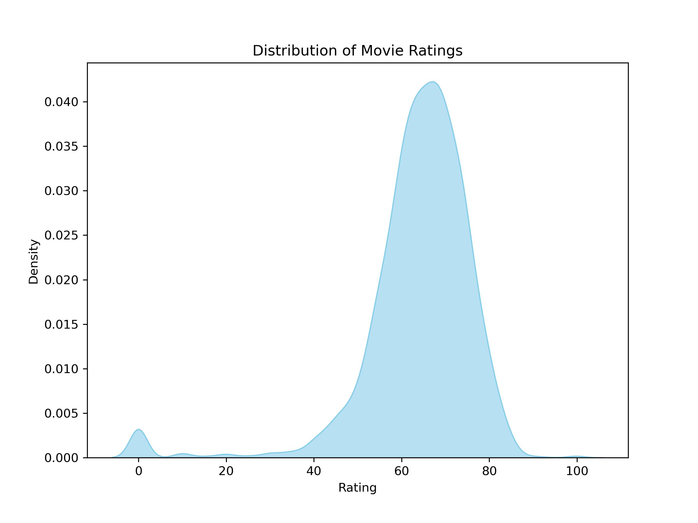
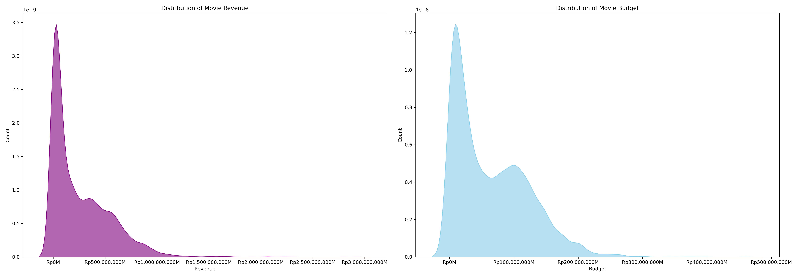
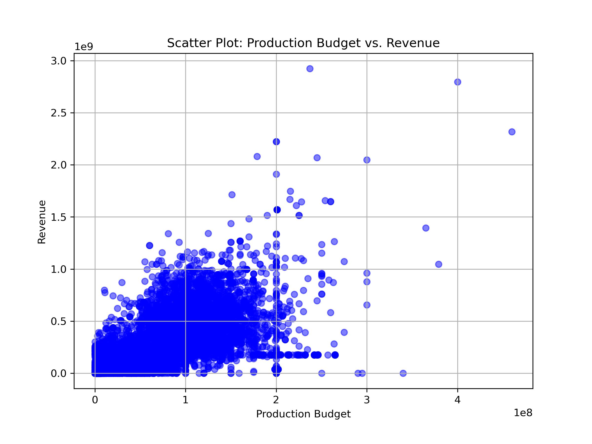
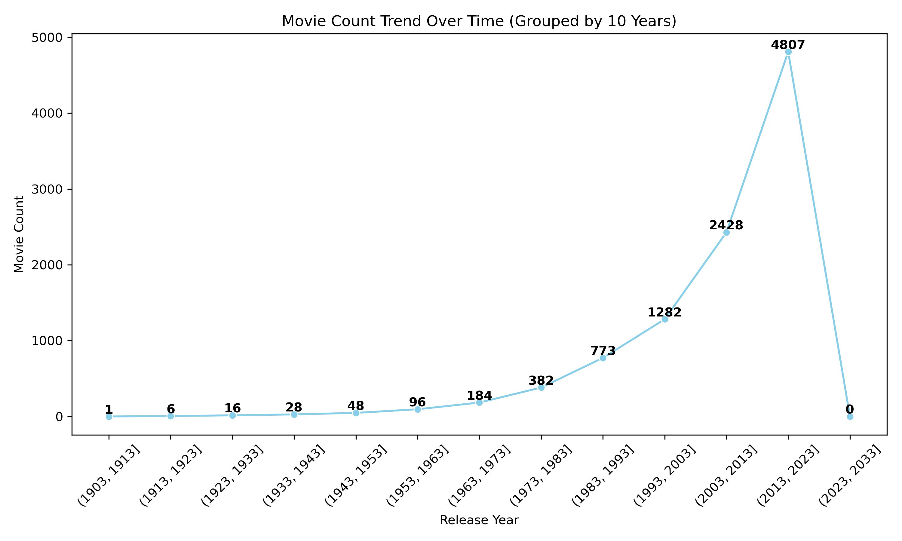
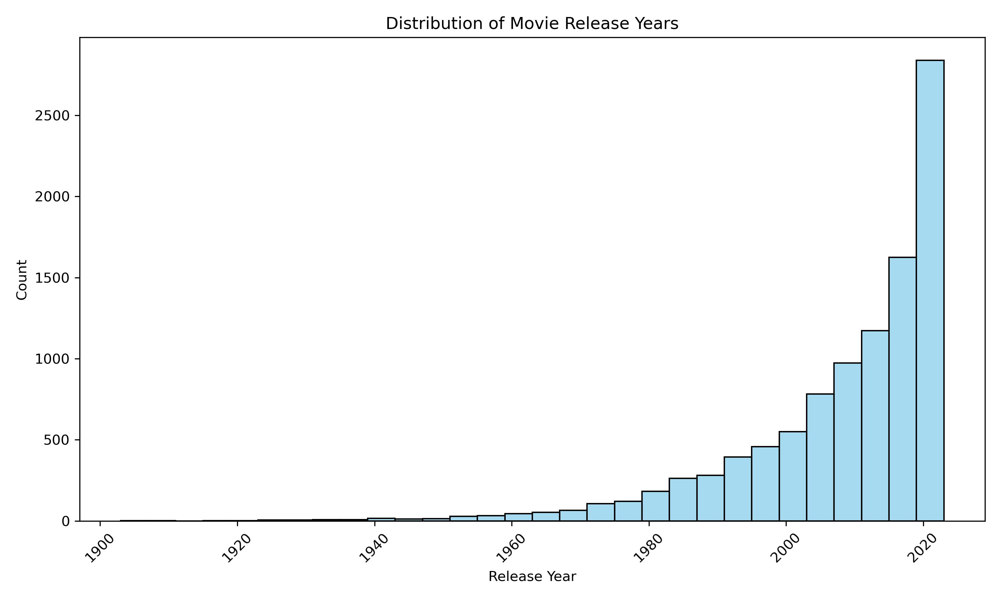

# **Laporan Proyek Machine Learning - Tony Wijaya**

## Project Overview

### Latar Belakang

Dewasa ini, website yang berisi video dan komunitas film, seperti Netflix, MovieLens, Youtube dan sebagainya, sudah sangat populer saat ini. Pada website tersebut memiliki banyak user dan kemudian user tersebut bisa memberi penilaian terhadap film yang tersedia. Melihat review terlebih dahulu merupakan salah satu cara untuk mengetahui kualitas dari film tersebut. Namun, banyaknya jumlah user yang memberi review berbeda-beda pada suatu film membuat pembaca kebingunan dalam menyimpulkan review tersebut.
Selera setiap orang pasti berdeda. Seseorang bisa menyukai film berdasarkan genre, aktor atau rumah produksi. Hal ini yang menjadi permasalahan seseorang dalam menentukan film yang sesuai dengan ekspektasi. Mengingat jumlah film yang begitu banyak dan beragam jenisnya, seseorang tentu tidak memiliki cukup waktu untuk memeriksa sinopsis atau trailer satu per satu. Belum lagi jika ada film baru yang belum diketahui judulnya. Maka dari itu harapan seseorang adalah menginginkan rekomendasi film yang sesuai harapan dari berbagai aspek dengan efektifitas waktu yang maksimal[1].

## Business Understanding

### Problem Statements

Menjelaskan pernyataan masalah latar belakang:

* Bagaimana membuat sistem untuk memberikan rekomendasi kepada pengguna film apa yang cocok dengan film yang sebelumnya telah ditonton?

### Goals

Menjelaskan tujuan dari pernyataan masalah:

* Memberikan analisa terkait hubungan antara _genre_, _crew_, _origin language_, _rating_ dan overview dari film tersebut dan membuat rekomendasi berdasarkan variabel diatas. 

## Data Understanding
_[Dataset](https://www.kaggle.com/datasets/ashpalsingh1525/imdb-movies-dataset)_ yang digunakan berasal dari kaggle. _Dataset_ hanya berisi 1 data yaitu imdb_movies.csv yang berisi data movies dari _Internet_ _Movie_ _Database_ (IMDb) yang merupakan _database_ informasi online yang berkaitan dengan film, serial televisi, podcast, video rumahan, video game, dan konten streaming online – termasuk pemeran, kru produksi dan biografi pribadi, ringkasan plot, trivia, peringkat, dan ulasan penggemar dan kritis.

Berikut adalah variabel yang digunakan pada _dataset_ tersebut

* _names_ : Nama film. Variabel ini berisi nama-nama film dalam dataset. Setiap entri mewakili satu film.
* _date_x_ : Tanggal rilis film. Variabel ini menyimpan tanggal rilis setiap film dalam format tanggal.
* _score_ : Skor atau rating film. Variabel ini berisi skor atau rating yang diberikan kepada setiap film, mungkin berdasarkan penilaian kritikus, peringkat pengguna, atau metrik lainnya.
* _genre_ : Genre film. Variabel ini berisi informasi tentang genre-genre yang mendefinisikan kategori film tersebut, misalnya, drama, komedi, aksi, fiksi ilmiah, dsb.
* _overview_ : Ringkasan atau deskripsi singkat film. Variabel ini berisi ringkasan atau deskripsi singkat tentang plot atau isi dari setiap film.
* _crew_ : Informasi tentang kru produksi film. Variabel ini mungkin berisi nama-nama orang yang terlibat dalam produksi film, seperti sutradara, penulis skenario, produser, dan anggota kru lainnya.
* _status_ : Status film. Variabel ini menunjukkan status produksi film, misalnya _"Released"_ (Telah dirilis), _"In Production"_ (Sedang diproduksi) dan _"Post Production"_ (pasca produksi).
* _orig_lang_ : Bahasa asli film. Variabel ini berisi informasi tentang bahasa asli yang digunakan dalam film.
* _budget_x_ : Anggaran produksi film. Variabel ini menunjukkan perkiraan biaya produksi film dalam mata uang tertentu.
* _revenue_ : Pendapatan film. Variabel ini berisi informasi tentang total pendapatan yang dihasilkan oleh film, biasanya dalam mata uang tertentu.
* _country_  : Negara produksi film. Variabel ini berisi informasi tentang negara atau negara-negara di mana film diproduksi.

Setelah melewati masa pembersihan berikut adalah deskripsi dari masing-masing variabel yang dibagi menjadi data numerik dan kategorikal

describe variabel

## Data Preparation

Langkah-langkah pada data preparation
1. _Data_ _Preparation_
2. _Check_ _Data_ _Duplication_
3. _Check_ _Missing_ _Value_
4. _Data_ _Preprocessing_
5. _EDA_
6. Tentukan _features_ untuk melakukan rekomendasi

### Data Preparation
Langkah-langkah pada tahap _data_ _preparation_
1. Mulai dari mengimport _library_ yang akan dibutuhkan, 
2. Melakukan read data csv menggunakan _library_ pandas
3. Melakukan inspeksi sederhana 
    * Melihat 5 data pertama
    * Melihat berapa jumlah data (10178 baris data)
    * Melihat variabel dan tipe data untuk dianalisa
    
### Check Data Duplication

Terdapat 0 data yang duplikat sehingga dataset dalam keadaan yang cukup prima untuk dilanjutkan analisanya.

### Check Missing Value

Tabel 1 . _Missing_ _Value_ 

|    | variable   | dtype   |   count |   unique |   missing |
|---:|:-----------|:--------|--------:|---------:|----------:|
|  0 | names      | object  |   10178 |     9660 |         0 |
|  1 | date_x     | object  |   10178 |     5688 |         0 |
|  2 | score      | float64 |   10178 |       79 |         0 |
|  3 | genre      | object  |   10178 |     2304 |        85 |
|  4 | overview   | object  |   10178 |     9905 |         0 |
|  5 | crew       | object  |   10178 |     9928 |        56 |
|  6 | orig_title | object  |   10178 |     9736 |         0 |
|  7 | status     | object  |   10178 |        3 |         0 |
|  8 | orig_lang  | object  |   10178 |       54 |         0 |
|  9 | budget_x   | float64 |   10178 |     2316 |         0 |
| 10 | revenue    | float64 |   10178 |     8227 |         0 |
| 11 | country    | object  |   10178 |       60 |         0 |
    

Ada _missing_ _Value_ sebanyak 85 pada bagian genre dan 56 pada crew

### Data Preprocessing

1. Setelah di cek pada kolom genre tidak ada referensi yang cukup untuk melakukan _fill missing value_ sehingga diambil langkah untuk melakukan drop data saja dikarenakan hanya terdapat 85 data dan tidak terlalu menggangu analisa. Begitu juga dengan kolom crew tidak ada referensi ynag cukup untuk melakukan _fill missing value_ sehingga diambil langkah yang sama yaitu melakukan drop data saja.

|    | variable   | dtype   |   count |   unique |   missing |
|---:|:-----------|:--------|--------:|---------:|----------:|
|  0 | names      | object  |   10052 |     9538 |         0 |
|  1 | date_x     | object  |   10052 |     5642 |         0 |
|  2 | score      | float64 |   10052 |       78 |         0 |
|  3 | genre      | object  |   10052 |     2300 |         0 |
|  4 | overview   | object  |   10052 |     9810 |         0 |
|  5 | crew       | object  |   10052 |     9857 |         0 |
|  6 | orig_title | object  |   10052 |     9614 |         0 |
|  7 | status     | object  |   10052 |        3 |         0 |
|  8 | orig_lang  | object  |   10052 |       53 |         0 |
|  9 | budget_x   | float64 |   10052 |     2311 |         0 |
| 10 | revenue    | float64 |   10052 |     8202 |         0 |
| 11 | country    | object  |   10052 |       57 |         0 |

Dapat dilihat setelah data yang _missing_ berhasil di _drop_ maka hanya terdapat 10052 data.

2. Mengubah kolom date_x menjadi tipe datetime yaitu dengan nama kolom baru release_date
3. Kolom Revenue dan budget yang diubah menjadi rupiah dengan bantuan libray locale. Penamaan kolom baru yaitu revenue_formatted dan budget_formatted
4. Menguba kolom genre menggunakan tdidfvectorizer untuk melakukan mapping data genre ke beberapa kolom.

| names                                                   |   action |       tv |   mystery |   western |   horror |   thriller |   fantasy |   family |   romance |   war |   documentary |   fiction |   crime |   music |   comedy |    drama |    movie |   animation |   science |   adventure |   history |
|:--------------------------------------------------------|---------:|---------:|----------:|----------:|---------:|-----------:|----------:|---------:|----------:|------:|--------------:|----------:|--------:|--------:|---------:|---------:|---------:|------------:|----------:|------------:|----------:|
| Mona Lisa Smile                                         | 0        | 0        |         0 |         0 |        0 |          0 |         0 | 0        |  0.526189 |     0 |             0 |  0        |       0 |       0 | 0        | 0.363478 | 0        |           0 |  0        |    0        |  0.768771 |
| Tank Girl                                               | 0.425001 | 0        |         0 |         0 |        0 |          0 |         0 | 0        |  0        |     0 |             0 |  0.569694 |       0 |       0 | 0.412639 | 0        | 0        |           0 |  0.569694 |    0        |  0        |
| A.I. Rising                                             | 0        | 0        |         0 |         0 |        0 |          0 |         0 | 0        |  0.512691 |     0 |             0 |  0.553047 |       0 |       0 | 0        | 0.354154 | 0        |           0 |  0.553047 |    0        |  0        |
| Pamasahe                                                | 0        | 0        |         0 |         0 |        0 |          0 |         0 | 0        |  0        |     0 |             0 |  0        |       0 |       0 | 0        | 1        | 0        |           0 |  0        |    0        |  0        |
| Pearl                                                   | 0        | 0        |         0 |         0 |        1 |          0 |         0 | 0        |  0        |     0 |             0 |  0        |       0 |       0 | 0        | 0        | 0        |           0 |  0        |    0        |  0        |
| The Ten Commandments                                    | 0        | 0        |         0 |         0 |        0 |          0 |         0 | 0        |  0        |     0 |             0 |  0        |       0 |       0 | 0        | 1        | 0        |           0 |  0        |    0        |  0        |
| Stolen by Their Father                                  | 0        | 0.679706 |         0 |         0 |        0 |          0 |         0 | 0        |  0        |     0 |             0 |  0        |       0 |       0 | 0        | 0.27568  | 0.679706 |           0 |  0        |    0        |  0        |
| The Holiday                                             | 0        | 0        |         0 |         0 |        0 |          0 |         0 | 0        |  0.787994 |     0 |             0 |  0        |       0 |       0 | 0.615683 | 0        | 0        |           0 |  0        |    0        |  0        |
| Solo: A Star Wars Story                                 | 0.410032 | 0        |         0 |         0 |        0 |          0 |         0 | 0        |  0        |     0 |             0 |  0.549629 |       0 |       0 | 0        | 0        | 0        |           0 |  0.549629 |    0.477168 |  0        |
| Teenage Mutant Ninja Turtles II: The Secret of the Ooze | 0.341746 | 0        |         0 |         0 |        0 |          0 |         0 | 0.441869 |  0        |     0 |             0 |  0.458094 |       0 |       0 | 0.331805 | 0        | 0        |           0 |  0.458094 |    0.397701 |  0        |

> TfidfVectorizer menggunakan kosakata dalam memori (dict python) untuk memetakan kata yang paling sering ke indeks fitur dan karenanya menghitung matriks frekuensi kemunculan kata (jarang).

5. Mengubah data genre dalam bentuk one hot encoding yang kurang lebih berfungsi untuk melakukan mapping beberapa genre menjadi beberapa kolom.

|    | names                       |   Action |   Adventure |   Animation |   Comedy |   Crime |   Documentary |   Drama |   Family |   Fantasy |   History |   Horror |   Music |   Mystery |   Romance |   Science Fiction |   TV Movie |   Thriller |   War |   Western |
|---:|:----------------------------|---------:|------------:|------------:|---------:|--------:|--------------:|--------:|---------:|----------:|----------:|---------:|--------:|----------:|----------:|------------------:|-----------:|-----------:|------:|----------:|
|  0 | Creed III                   |        1 |           0 |           0 |        0 |       0 |             0 |       1 |        0 |         0 |         0 |        0 |       0 |         0 |         0 |                 0 |          0 |          0 |     0 |         0 |
|  1 | Avatar: The Way of Water    |        1 |           1 |           0 |        0 |       0 |             0 |       0 |        0 |         0 |         0 |        0 |       0 |         0 |         0 |                 1 |          0 |          0 |     0 |         0 |
|  2 | The Super Mario Bros. Movie |        0 |           1 |           1 |        1 |       0 |             0 |       0 |        1 |         1 |         0 |        0 |       0 |         0 |         0 |                 0 |          0 |          0 |     0 |         0 |
|  3 | Mummies                     |        0 |           1 |           1 |        1 |       0 |             0 |       0 |        1 |         1 |         0 |        0 |       0 |         0 |         0 |                 0 |          0 |          0 |     0 |         0 |
|  4 | Supercell                   |        1 |           0 |           0 |        0 |       0 |             0 |       0 |        0 |         0 |         0 |        0 |       0 |         0 |         0 |                 0 |          0 |          0 |     0 |         0 |
> Pengodean satu-panas dalam pembelajaran mesin adalah konversi informasi kategorikal ke dalam format yang dapat dimasukkan ke dalam algoritme pembelajaran mesin untuk meningkatkan akurasi prediksi. Pengkodean satu-panas adalah metode umum untuk menangani data kategorikal dalam pembelajaran mesin.

> Catatan: Perbedaan one-hot-encoding vs tfidfvectorizer 
>>* TfidfVectorizer: Term Frequency-Inverse Document Frequency (TF-IDF) adalah representasi numerik yang mencerminkan pentingnya kata dalam dokumen relatif terhadap kumpulan dokumen. Itu mengubah kumpulan dokumen teks menjadi matriks fitur TF-IDF, di mana setiap baris sesuai dengan dokumen, dan setiap kolom sesuai dengan kata unik di seluruh korpus.
>>* One-Hot Encoding: One-hot encoding adalah teknik yang digunakan untuk mengubah variabel kategori (seperti kata) menjadi vektor biner. Setiap kata diwakili oleh vektor nol kecuali untuk indeks yang sesuai dengan posisi kata dalam kosakata, yang diatur ke 1. Ini menciptakan representasi biner dari setiap kata ada atau tidak ada dalam dokumen tertentu.

6. Mengubah kolom overview menggunakan embeddings model dari bert menjadi dalam bentuk vector atau numerik agar dapat dilihat kesamaannya.
> Word embeddings adalah proses konversi kata yang berupa karakter alphanumeric kedalam bentuk vector. Setiap kata adalah vector yang merepresentasikan sebuah titik pada space dengan dimensi tertentu. Dengan word embedding, kata-kata yang memiliki properti tertentu, misalnya berada pada konteks yang sama, atau memiliki semantic meaning yang sama berada tidak jauh satu sama lain pada space tersebut.

7. Rating Score yang diubah dalam bentuk array yang merupakan sebuah fitur yang menarik dalam proses rekomendasi.
### EDA

1. Hasil dari Univariate analysis
    * Genre yang terdapat pada dataset 
        * Action
        * Adventure
        * Animation
        * Comedy
        * Crime
        * Documentary
        * Drama
        * Family
        * Fantasy
        * History
        * Horror
        * Music
        * Mystery
        * Romance
        * Science Fiction
        * TV Movie
        * Thriller
        * War
        * Western
    * Origin language yang terdapat pada dataset
        - Arabic
        - Basque
        - Bengali
        - Bokmål
        - Cantonese
        - Castilian
        - Catalan
        - Central Khmer
        - Chinese
        - Czech
        - Danish
        - Dutch
        - Dzongkha
        - English
        - Finnish
        - Flemish
        - French
        - Galician
        - German
        - Greek
        - Gujarati
        - Hindi
        - Hungarian
        - Icelandic
        - Indonesian
        - Irish
        - Italian
        - Japanese
        - Kannada
        - Korean
        - Latin
        - Latvian
        - Macedonian
        - Malay
        - Malayalam
    * Pengambilan data dari _release_date_ terlama dikurang terbaru adalah 120.06 tahun

#### Bagaimana distribusi rating film dalam dataset?

Gambar 1. Distribusi rating film

Dapat dilihat pada gambar 1 puncak distribusi rating terbanyak berada di angka 60-80 dimana dapat disimpulkan _overall sscore_ untuk menentukan film itu termasuk dalam kategori bagus atau layak ditonton berada di angka 60-80.

#### Bagaimana distribusi pendapatan (revenue) dan budget film dalam dataset?

Gambar 2. Distribusi _budget_ dan _revenue_ pada film

Dapat dilihat bahwa melalui gambar 2 bahwa kebanyakan produksi berada di angka 500 juta hingga 1 miliar adalah hal yang wajar untuk membuat film yang bagus.

#### Apakah ada korelasi antara anggaran produksi dan pendapatan film?

Gambar 3. Hubungan budget dan revenue yang didapatkan

Dapat dilihat pada gambar 3 bahwa adanya hubungan atau korelasi antara budget yang dibutuhkan untuk produksi mempengaruhi pemasukan yang didapatkan. Jika menggunakan budget yang tinggi maka revenue yang didapatkan juga meningkat namun belum dapat dinyatakan linear karena revenue dipengaruhi banyak hal lainnya.

#### Bagaimana distribusi tahun rilis film dalam dataset?

Gambar 4. Distribusi tahun rilis film

Dapat dilihat pada gambar 4 bahwa dari tahun ke tahun produksi film sangat meningkat. Dapat disimpulkan bahwa kebutuhan akan film untuk hiburan itu adalah hal yang cukup masuk akal.

#### Apakah ada tren peningkatan atau penurunan jumlah film dari waktu ke waktu?

Gambar 5. tren dari jumlah film yang diproduksi dari waktu ke waktu

Dapat dilihat pada gambar 5 sama halnya dari tahun ke tahun terjadi tren yang meningkat dan juga dipengaruhi oleh era teknologi sehingga film menjadi salah satu hiburan yang menarik.

## Modeling

Untuk membantu rekomendasi maka dipilih beberapa fitur rekomendasi
1. Overview yang sudah di embbedings
2. Rating score yang sudah diubah menjadi bentuk array
3. Genre dalam bentuk tfidfvectorizer
4. Genre dalam bentuk one hot encoding

Pada kasus kali ini maka digunakan content-based filtering untuk memberikan rekomendasi.
> content-based filtering  : menggunakan fitur item untuk merekomendasikan item lain yang serupa dengan apa yang disukai pengguna, berdasarkan tindakan mereka sebelumnya atau umpan balik eksplisit.

Akan 2 teknik yang akan digunakan yaitu menggunakan fitur genre yang sudah di tfidfvectorizer dan one hot encoding.

Berikut adalah langkah-langkah untuk melakukan rekomendasi.

1. PCA data features
> Analisis komponen utama, atau PCA, adalah prosedur statistik yang memungkinkan Anda untuk meringkas konten informasi dalam tabel data besar melalui serangkaian "indeks ringkasan" yang lebih kecil yang dapat divisualisasikan dan dianalisis dengan lebih mudah.
2. Melakukan rekomendasi dengan melihat _coisine simalirity_
> _coisine simalirity_ mengukur kesamaan antara dua vektor ruang produk dalam. Itu diukur dengan cosinus sudut antara dua vektor dan menentukan apakah dua vektor menunjuk ke arah yang kira-kira sama. Ini sering digunakan untuk mengukur kesamaan dokumen dalam analisis teks.

## Evaluation
Pada bagian ini Anda perlu menyebutkan metrik evaluasi yang digunakan. Kemudian, jelaskan hasil proyek berdasarkan metrik evaluasi tersebut.

Ingatlah, metrik evaluasi yang digunakan harus sesuai dengan konteks data, problem statement, dan solusi yang diinginkan.

## Kesimpulan

## Daftar Pustaka

[1] E. Ryana Agustian and E. Prasetyo Nugroho, “Sistem Rekomendasi Film Menggunakan Metode Collaborative Filtering dan K-Nearest Neighbors Film Recommendation System Using Collaborative Filtering Method and K-Nearest Neighbors,” vol. 3, no. 1, pp. 18–21, 2020, [Online]. Available: https://ejournal.upi.edu/index.php/JATIKOM.

[2] J. Devlin, M. W. Chang, K. Lee, and K. Toutanova, “BERT: Pre-training of deep bidirectional transformers for language understanding,” NAACL HLT 2019 - 2019 Conf. North Am. Chapter Assoc. Comput. Linguist. Hum. Lang. Technol. - Proc. Conf., vol. 1, no. Mlm, pp. 4171–4186, 2019.

[3] M. Fajriansyah, P. P. Adikara, and A. W. Widodo, “Sistem Rekomendasi Film Menggunakan Metode Content Based Filtering,” J. Pengemb. Teknol. Inf. dan Ilmu Komput., vol. 5, no. 6, pp. 2188–2199, 2021, [Online]. Available: http://e-journal.uajy.ac.id/20600/.